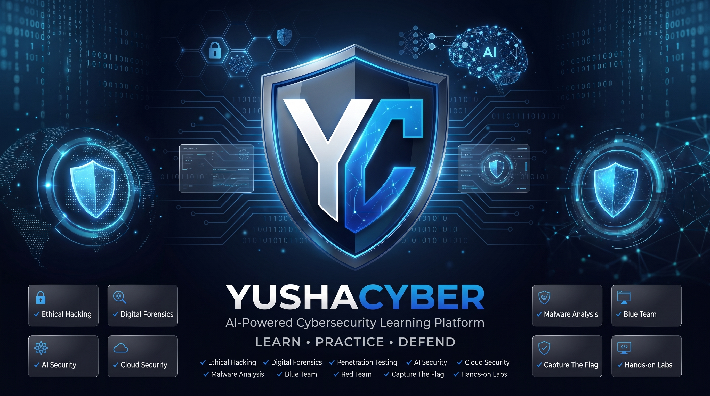

  

<h1 align="center">Hi 👋, I'm Ayush</h1>

<h3 align="center">
AI Developer • Cybersecurity Enthusiast • Python Programmer
</h3>

Building intelligent software, exploring cybersecurity, and creating open-source projects that solve real-world problems.

  

---

# 🚀 About Me

- 🧠 Passionate about **Artificial Intelligence** and **Cybersecurity**
- 🐍 Python developer focused on automation and intelligent applications
- 💻 Building modern desktop and web applications
- 🌱 Always learning new technologies and improving my skills
- 🤝 Open to collaboration on innovative open-source projects

---

# 🛠️ Tech Stack

### Programming Languages

### Frameworks & Libraries

### Tools & Technologies

---

# 📊 GitHub Statistics

  
  

---

# 🔥 GitHub Streak

---

# 🏆 GitHub Trophies

---

# 📈 Contribution Graph

---

# 📫 Connect With Me

---

⭐ Thanks for visiting my profile! If you like my work, consider following me and checking out my repositories.

